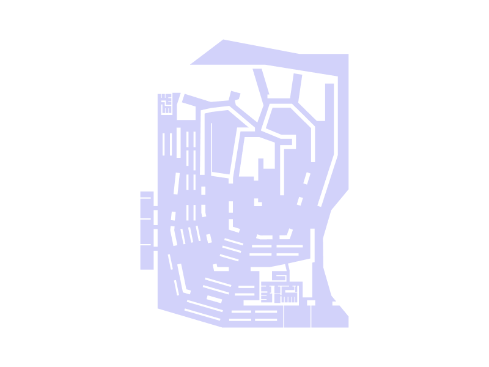
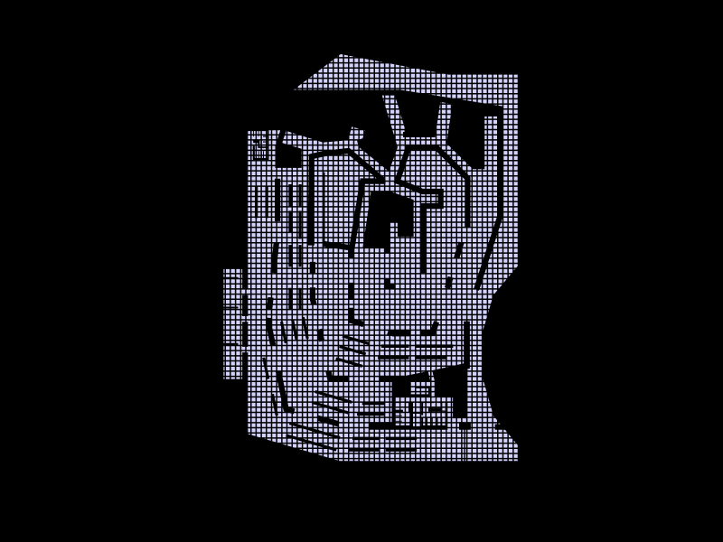
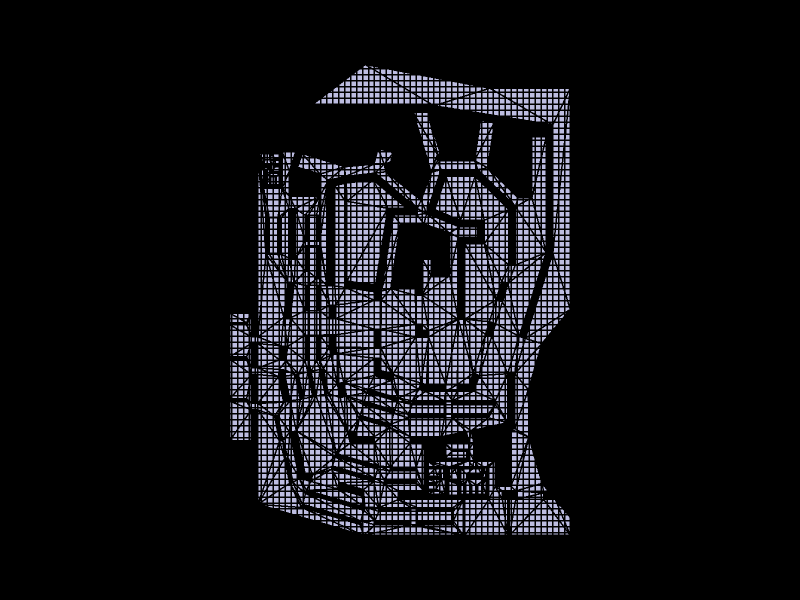
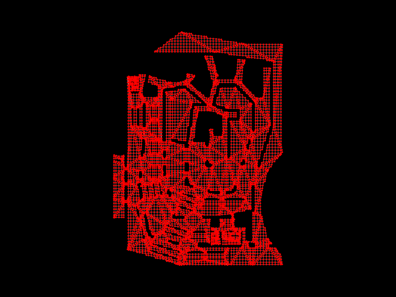
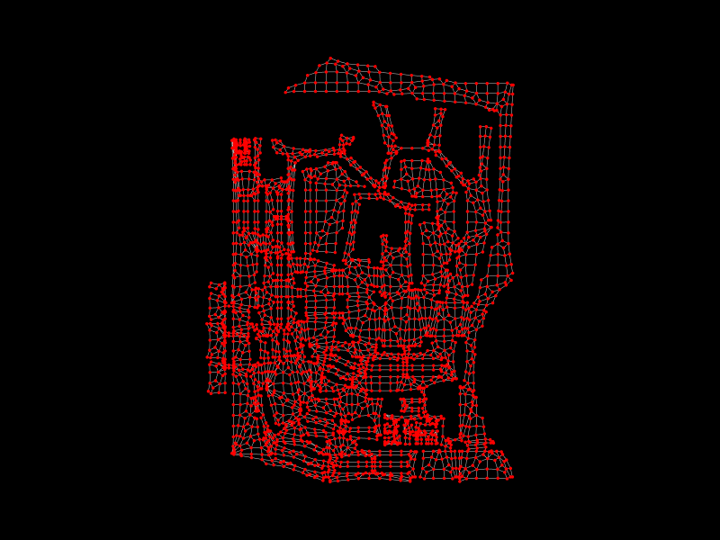
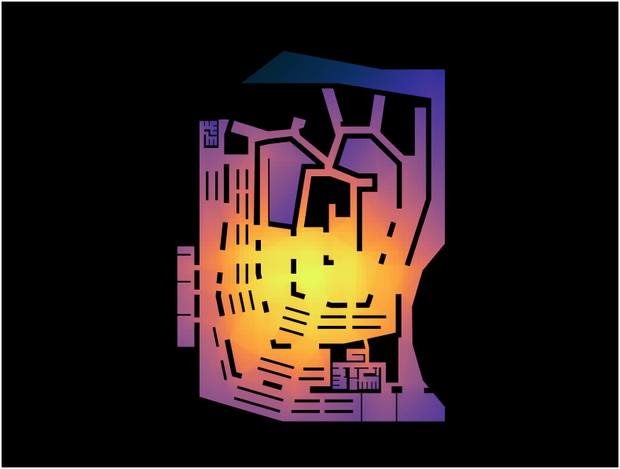
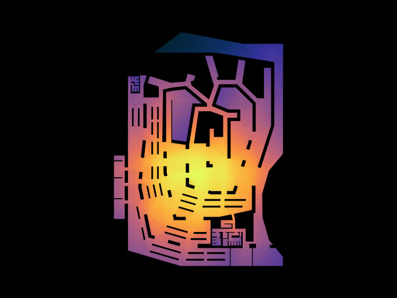
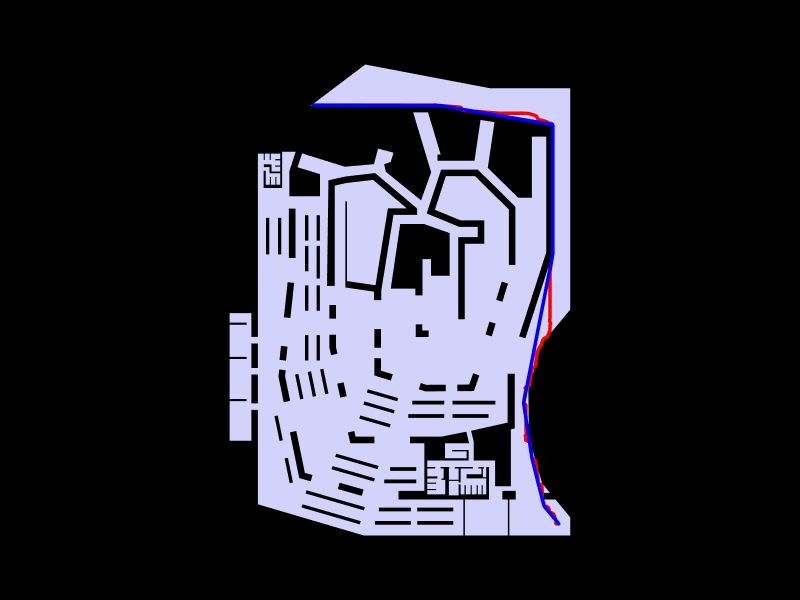

# Graph Analysis of Musashino Art University Library
**GraphML — Assignment 02**
**Author:** Lakzhmy
**Date:** May 2026
**Tool:** TopologicPy + Python (Jupyter Notebook)

---

## 1. Building Overview

The Musashino Art University Library, designed by Sou Fujimoto Architects (completed 2010), is one of the most spatially inventive library buildings of recent decades. Its defining feature is a continuous spiral of wooden bookshelves that simultaneously functions as the building's walls, partitions, and primary circulation spine. The floor plan is non-orthogonal — the outer boundary is an irregular, curved polygon — and the interior is organized around a large central void formed by the converging shelf-walls, surrounded by open reading and browsing areas.

This report applies graph-based spatial analysis to the floor plan to quantify and interpret its spatial structure — identifying which zones are most accessible, where bottlenecks form, and how circulation is distributed across the building.

---

## 2. Methodology

### 2.1 From Floor Plan to Graph

The analysis workflow proceeds in the following steps:

1. **Import geometry** — The floor plan was imported from an `.obj` file and converted to a topological shell (`topologicpy.Shell`).
2. **Grid discretisation** — A 1×1-unit grid was overlaid on the bounding rectangle of the floor plan and clipped to its outline, subdividing the continuous surface into discrete face cells.
3. **Graph extraction** — Two graphs were derived from the shell:
   - **Analysis Graph** — centroid-to-centroid connections between adjacent faces (used for centrality metrics).
   - **Navigation Graph** — connectivity via shared edges (used for shortest path routing).
4. **Metric computation** — Three spatial metrics were computed: Degree Centrality, Closeness Centrality, and Betweenness Centrality, plus a Shortest Path query.
5. **Visualisation** — Metric values were mapped back onto the floor plan faces using a thermal colour scale (blue–purple = low, orange–yellow = high).

---

## 3. Visualisations

### 3.1 Floor Plan Topology
Raw imported floor geometry — the building's irregular perimeter and internal void structure (bookshelf walls, structural elements, and open areas) are clearly visible.

### 3.2 Grid Overlay
A 1×1-unit grid clipped to the floor plan outline. Each cell becomes a node in the analysis graph.

### 3.3 Discretised Shell
The floor plan after slicing by the grid, producing the topological shell of face cells.

### 3.4 Analysis Graph
The graph derived from the shell. Red vertices sit at each face centroid; grey edges connect spatially adjacent faces. The density of connections reveals open, traversable zones versus blocked areas (voids, walls).

### 3.5 Closeness Centrality — Thermal Heatmap
Colour encodes closeness centrality (thermal scale: yellow-orange = high integration, blue-purple = low).

### 3.6 Betweenness Centrality — Thermal Heatmap
Colour encodes normalised betweenness centrality. High values indicate cells that frequently appear on shortest paths between all other pairs of cells.

### 3.7 Shortest Path
Red = original topological shortest path (upper-left corner → lower-right corner, **114.46 units**).
Blue = geometrically straightened path (**109.37 units**). Both routes hug the right perimeter of the building.

---

## 4. Graph Metrics

### 4.1 Degree Centrality

**Definition:** The degree of a node is the number of direct neighbours (adjacent cells). Degree centrality normalises this by the maximum possible degree:

$$DC(v) = \frac{\deg(v)}{n - 1}$$

In a grid graph, interior cells in open areas have up to **4 neighbours** (N, S, E, W); cells adjacent to a wall or void have fewer. Degree centrality therefore acts as a local openness indicator.

| Zone | Degree Centrality | Interpretation |
|---|---|---|
| Open reading / browsing area (lower-centre) | High (≈ 3–4 neighbours) | Freely traversable open floor |
| Bookshelf-wall corridor interfaces | Medium (2–3 neighbours) | Constrained by shelf walls on one or more sides |
| Central void and structural cores | Low (0–1 neighbours) | Physically inaccessible cells, blocked by shelves or walls |
| Perimeter / boundary cells | Low–Medium | Edge of building — only inward-facing neighbours |

**Key finding:** The open lower-central area of the library, which corresponds to the main browsing and reading zone between the converging shelf spirals, has the highest degree centrality. The upper section, where the shelf-walls branch into a tree-like arrangement, has significantly reduced local connectivity — cells are more isolated from their immediate neighbourhood.

---

### 4.2 Closeness Centrality

**Definition:** Closeness centrality measures how close a node is to all other nodes in the graph, defined as the reciprocal of the average shortest path length to every other node:

$$CC(v) = \frac{n-1}{\sum_{u \neq v} d(v,u)}$$

In space syntax terms, this corresponds to **global integration** — a high closeness value means a space can be reached from anywhere in the building with fewer traversal steps.

**Results (from thermal heatmap — `Musashino_Show_Heat.png`):**

| Zone | Closeness Centrality | Interpretation |
|---|---|---|
| Central lower zone (open floor area) | **Highest** — bright yellow-orange core | Most globally accessible space in the building |
| Mid-floor transitional areas | Medium — orange to amber gradient | Moderate accessibility; key intermediate zones |
| Upper branching shelf-wall zone | Low — blue to purple | Topologically deep; requires many steps to reach from most other spaces |
| North corner (entry canopy/overhang) | **Lowest** — deep blue | Most peripheral; highest topological depth |
| Perimeter east and west edges | Low | Boundary condition; one-sided connectivity only |

**Key finding:** The warm core in the closeness heatmap sits in the **open central-lower area**, roughly corresponding to the primary reading hall and the convergence point of the spiral bookshelf system. This is the building's natural "spatial heart" — the space with the greatest topological proximity to all other spaces. The upper zone, where the shelf-walls fan outward and divide into smaller bays, is topologically deep, meaning visitors must pass through many intermediate spaces to reach it.

---

### 4.3 Betweenness Centrality

**Definition:** Betweenness centrality counts how many shortest paths between all pairs of nodes pass through a given node, normalised to [0, 1]:

$$BC(v) = \frac{2}{(n-1)(n-2)} \sum_{s \neq v \neq t} \frac{\sigma_{st}(v)}{\sigma_{st}}$$

where $\sigma_{st}$ is the total number of shortest paths from $s$ to $t$, and $\sigma_{st}(v)$ is those that pass through $v$. High betweenness indicates a **bottleneck or connector** — a space through which most through-movement must funnel.

**Results (from `Musashino_Show_Heat1.png`):**

| Zone | Betweenness Centrality | Interpretation |
|---|---|---|
| Open lower-central area | **Highest** | Primary movement corridor; critical spatial connector |
| Narrow bookshelf corridor passages | High (localised) | Pinch points — removing these cells would disconnect sub-graphs |
| Right perimeter (east face) | Medium-High | Key route for long-distance traversal (confirmed by shortest path) |
| Upper shelf-wall bays | Low | Dead-end-like spaces; minimal through-traffic |
| Extreme perimeter corners | Lowest | Rarely on any shortest path |

**Key finding:** The betweenness heatmap closely mirrors the closeness map, but with a sharper distinction between the high-centrality core and the rest. The **central lower zone acts as a mandatory through-space** for movement across the entire floor plate. The narrow passages through the bookshelf walls show localised spikes in betweenness — these are structural bottlenecks where removing or blocking the passage would significantly disrupt overall circulation. This matches the intended design logic: the bookshelf walls guide movement through defined thresholds.

---

### 4.4 Shortest Path

**Query:** From the upper-left corner `(xmin+2, ymax-2)` to the lower-right corner `(xmax-2, ymin+2)` — a full diagonal traversal of the floor plate.

| Metric | Value |
|---|---|
| Original shortest path length | **114.46 units** |
| Geometrically straightened path | **109.37 units** |
| Savings from straightening | 5.09 units (≈ 4.4%) |
| Computation time (routing) | 5.06 s |
| Computation time (straightening) | ~120 s |

**Path route:** Both the original and straightened paths travel along the **right (east) perimeter** of the building, hugging the outer boundary from the top-right corner to the bottom-right corner. This is significant: despite the building having an open central floor area with high centrality, the direct diagonal route through the interior is blocked by the spiral bookshelf walls. The perimeter becomes the efficient long-distance route, while the interior supports local browsing movement.

The small difference between the raw and straightened paths (4.4%) confirms that the navigation graph already finds a geometrically efficient route — there is minimal redundancy in the path.

---

## 5. Interpretation of Results

### 5.1 Most Connected Spaces

The **central lower zone** — the open reading and browsing area between the converging shelf spirals — is the most connected space by all three metrics simultaneously:
- Highest local connectivity (Degree)
- Most globally accessible (Closeness)
- Most traversed by through-movement (Betweenness)

This zone functions as the spatial and programmatic core of the building. In Fujimoto's design intention, the continuous spiral of shelves leads visitors through an uninterrupted browsing experience, but the graph analysis confirms that the centre of that spiral convergence is also the topological centre of gravity.

### 5.2 Critical Connectors and Bottlenecks

The **passage thresholds through the bookshelf walls** register as localised betweenness spikes. These narrow openings are the architectural equivalent of bridges in a network — their removal would disconnect sub-regions of the floor plate. This is a deliberate design move: rather than an open plan, Fujimoto uses the bookshelf walls to channel movement and create a sense of spatial discovery while ensuring all parts of the building remain connected through defined thresholds.

The **east perimeter edge** acts as a secondary connector for long-distance traversal, as confirmed by the shortest path result. Visitors needing to cross the full extent of the building without deep penetration of the shelf zone will naturally gravitate toward the perimeter.

### 5.3 Clusters and Zones

Three broad spatial clusters emerge from the analysis:

| Cluster | Location | Characteristics |
|---|---|---|
| **High-integration core** | Lower centre | Open floor, max closeness and betweenness, primary movement zone |
| **Branching shelf zone** | Upper centre / upper left | Topologically deep, low global accessibility, exploratory character |
| **Peripheral boundary** | All edges | Low centrality, transitional function, provides long-distance routing |

---

## 6. Spatial Organisation Analysis

### 6.1 Circulation Patterns

The graph reveals a **dual-layer circulation system**:
1. **Local / browsing circulation** — operates through the open central area, leveraging the high local connectivity (degree) of the open floor. Movement here is diffuse and non-directional, consistent with the library's intention of encouraging spontaneous browsing.
2. **Long-distance / directional circulation** — routes around the perimeter or through the high-betweenness central corridor. This is efficient but passes through the same critical connector cells repeatedly, creating a channelling effect.

The absence of strong linear axes in the floor plan (confirmed by the lack of any single high-betweenness corridor) suggests that the building resists directional "desire lines" in favour of meandering exploration — a finding consistent with Fujimoto's stated design philosophy of blurring boundaries between movement and encounter.

### 6.2 Hierarchy of Spaces

The centrality gradients define a clear spatial hierarchy:

1. **Primary** — The open central-lower zone: high in all metrics, acts as the building's spatial anchor.
2. **Secondary** — The bookshelf passage thresholds: critical connectors but not open spaces; high betweenness but constrained degree.
3. **Tertiary** — The branching upper bays: topologically deep reading nooks, destination spaces rather than through-spaces.
4. **Boundary** — The perimeter cells: low global centrality but essential for long-distance routing.

This hierarchy mirrors the conventional library programme: the most accessible zone hosts the highest-demand function (open browsing/reference), while deeper zones house more specialised or quiet collections.

### 6.3 Accessibility and Connectivity

The floor plan is a single connected component — all cells are reachable from all other cells. However, the topological depth of the upper branching zone is notably high: reaching the furthest bays requires traversal through many intermediate spaces. This is a deliberate accessibility trade-off: the upper zones are not poorly designed, but intentionally deep, prioritising atmosphere and immersion over convenience.

The east perimeter offers the fastest connectivity between the north and south ends of the building, suggesting that service or staff circulation (requiring speed) would naturally use this edge.

### 6.4 Functional Zoning

The graph analysis reveals a zoning logic that is **emergent** rather than explicit — the bookshelf walls define zones not by labelled rooms but by topological depth:

| Zone Type | Graph Characteristic | Likely Programme |
|---|---|---|
| High centrality core | High degree, closeness, betweenness | Open reading, information desk, main browsing |
| Intermediate connectors | Medium centrality, high betweenness locally | Passages, threshold spaces, transitions |
| Deep branching bays | Low closeness, low degree | Quiet reading, specialised collections |
| Perimeter strip | Low closeness, medium betweenness for paths | Auxiliary programme, service, entry/exit |

---

## 7. Graph Analysis Results Summary

| Metric | Peak Location | Peak Value (relative) | Lowest Location |
|---|---|---|---|
| Degree Centrality | Open lower-centre | Max 4 neighbours (interior) | Void / wall cells (0) |
| Closeness Centrality | Open lower-centre | Highest (warm yellow-orange) | North corner (deep blue) |
| Betweenness Centrality | Open lower-centre + shelf passages | Highest (warm yellow-orange) | Far perimeter corners |
| Shortest Path (UL→LR) | East perimeter route | 114.46 units (raw) / 109.37 (straightened) | — |
| Graph Density (analysis) | Full graph | — (large grid graph) | — |

---

## 8. Why Graph Analysis Is Useful for Architectural Datasets

Traditional architectural analysis relies on qualitative description and visual reading of plans. Graph analysis adds a layer of **quantitative, reproducible spatial intelligence** that reveals properties invisible to the eye alone:

1. **Objective measurement of accessibility** — Closeness centrality gives a single comparable value to each space, enabling ranking without subjective judgement. In the Musashino Library, this confirms the intuition that the spiral core is central, but also reveals *how much more* central it is than the perimeter zones.

2. **Identification of hidden bottlenecks** — Betweenness centrality exposed the bookshelf passage thresholds as critical single-point connectors. This is design information with direct safety and wayfinding implications (e.g., evacuation planning, signage placement).

3. **Cross-scale analysis** — The same graph framework that characterises a single room can scale to an entire campus or urban network. This scalability makes it a powerful tool for multi-scale design decisions.

4. **Simulation support** — Shortest path results can seed pedestrian movement simulations, helping predict crowd flows and identify where congestion is likely under high-occupancy conditions.

5. **Design feedback** — By comparing centrality maps against intended programme locations, architects can verify whether the spatial logic of the plan supports the programme — or identify mismatches early in the design process.

In the case of Musashino Art University Library, the graph analysis validates the coherence of Sou Fujimoto's spatial strategy: the most integrated zone aligns precisely with the intended primary public area, the bookshelf walls successfully channel rather than fragment movement, and the topological depth of the branching bays supports quiet, contemplative use. The building's complexity is real, but it is structured complexity — and graph analysis makes that structure legible.

---

*Analysis performed using TopologicPy v0.9.26. Floor plan geometry sourced from `MusashinoLibrary_FloorPlate.obj`. Full computational workflow in `Musashino_Floor.ipynb`.*