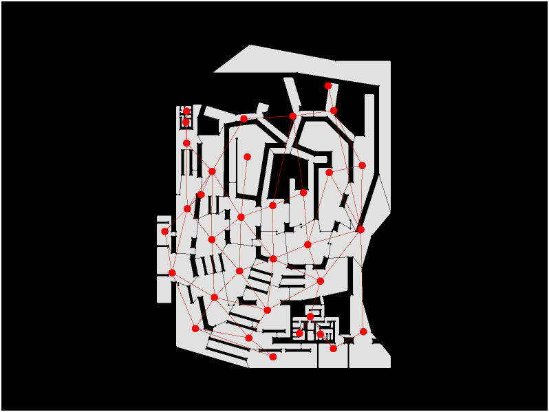
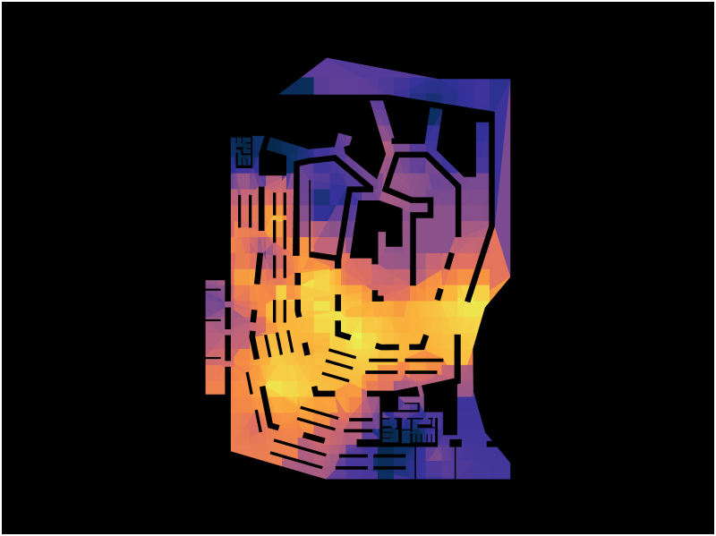
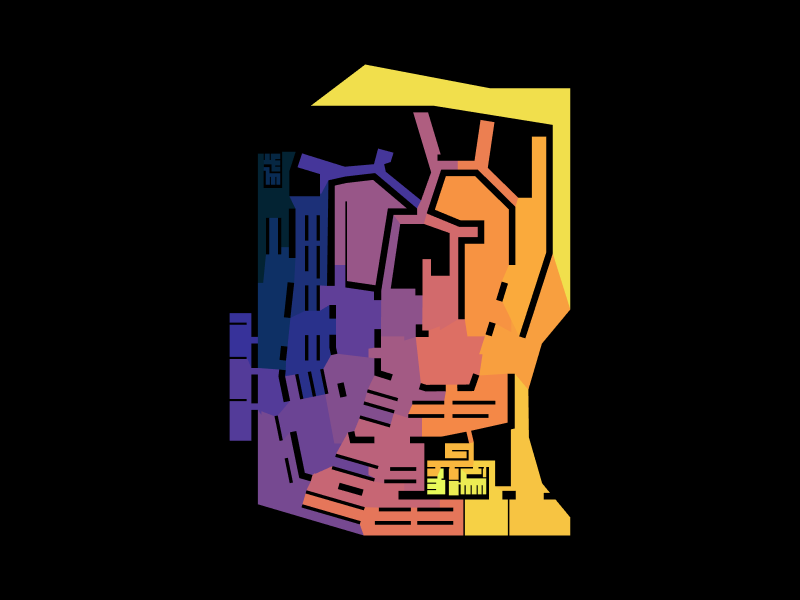

**Graph Analysis of Musashino Art University Library** 

GraphML — Assignment 02 by Lakzhmy Mari Zaro

TopologicPy \+ Python (Jupyter Notebook) 

**Building Overview** 

The Musashino Art University Library was designed by Sou Fujimoto Architects and completed in 2010\. The building is built around a single continuous spiral of wooden bookshelves, and these shelves do most of the work in the plan. They act as the walls, the partitions, and the main circulation route all at once. The outer edge of the building is not a regular rectangle but a curved, irregular polygon, and the inside opens up around a large central void where the shelf-walls meet. 

The aim of this report is to apply graph-based spatial analysis to the floor plan. I wanted to find out which spaces are most accessible, where movement gets squeezed through narrow passages, and how circulation is shared across the floor. The floor plan was converted into a spatial graph by overlaying a 1×1-unit grid, slicing it into discrete face cells, and deriving an analysis graph where each cell is a node and shared adjacencies are edges.

Five metrics were computed and visualized: the Analysis Graph (spatial network), Degree Centrality, Closeness Centrality, Shortest Path, and Community Detection.

![][image1]![][image2]

**Floor plan topology** 

The raw imported floor geometry. The irregular outer edge of the building is clearly visible, along with the internal voids made by the bookshelf walls and structural cores.

| ![][image3]

**Grid overlay** 

A 2×2 unit grid clipped to the plan outline. Each surviving cell becomes a node in the analysis graph. 

| ![][image4] | ![][image5] |
| :---- | :---- |

**Discretised shell** 

The floor plan after it has been sliced by the grid. The result is a shell of discrete face cells ready to be turned into a graph.

| ![][image6] | ![][image7] |
| :---- | :---- |

**Analysis graph** 

The graph pulled from the shell. Red dots sit at the centre of each face, and grey lines join cells that touch each other. Where the lines cluster, the floor is open and easy to cross. Where they thin out, the shelf-walls or voids are blocking movement. 

| ![][image8] | ![][image9] |
| :---- | :---- |

The analysis graph overlays the spatial network onto the floor plan. Each red dot is a node (face cell centroid) and each red line is a direct spatial connection between two adjacent cells.

Key findings:

* The lower-central area (the open reading and browsing zone between the converging shelf spirals) produces the densest node-edge cluster. Cells here have up to four neighbours in all directions, indicating a freely traversable, open floor.  
* The black voids cutting through the graph correspond to the bookshelf walls and structural masses. These are physically inaccessible cells that fragment the graph locally and force movement to route around them.  
* The upper zone, where the shelf-walls branch into a tree-like arrangement, shows significantly sparser connectivity. Node clusters are separated by voids, and several cells appear as near-terminal — reachable only through one or two adjacent cells. This is consistent with more enclosed, destination-type spaces (quiet reading bays, specialist collections).  
* The east perimeter maintains a relatively continuous chain of connected cells running the full height of the building, suggesting it functions as a long-distance routing edge even without being a designated corridor.

**Degree Centrality**

Colour shows how many direct neighbours each cell has. Yellow and orange mark cells with the most immediate connections; blue and purple mark cells that touch few others.

![][image12]![][image13]

<!-- 

 -->

Degree centrality measures the number of direct connections a node has. In a grid-based floor plan, interior cells in open areas can reach up to four neighbours (N, S, E, W); cells blocked by walls or voids on one or more sides have fewer. It is the most local of the metrics — it only sees immediate adjacency, not the wider network.

Key findings:

* The **brightest yellow-orange zone** sits in the lower-central open area, where the shelf spirals converge. Cells here have the maximum number of immediate neighbours, confirming this as the most locally open and traversable part of the floor. The warmth of this zone is broad and continuous, not concentrated on a single cell — it is a genuinely open field, not a single hub.
* The **upper branching zone** shows mostly blue and purple, meaning the shelf-wall bays have very few immediate neighbours. Many of these cells touch a void on two or three sides, leaving them connected only along a narrow corridor or from a single direction. This reflects the nature of the branching bays: you can only approach them from one end.
* The **east perimeter** is cooler (purple to blue) despite playing an important role in long-distance routing. Perimeter cells only connect inward — they have neighbours on at most two or three sides — so their local degree is inherently lower than interior cells. High routing value does not equal high local connectivity.
* The **degree heatmap is more granular than the closeness heatmap**: small pockets of lower degree appear within the otherwise warm central zone, corresponding to cells that sit adjacent to a bookshelf wall or narrow threshold. These local drops reveal exactly where the shelf-walls pinch movement even within the open floor area.
* The **DegreeGraph** confirms that most nodes in the open floor are well-connected to each other in a mesh pattern, while nodes in the upper zone form loose chains — a few connections each, in sequence — which is the graph signature of a dead-end corridor or a branching bay.

**Closeness centrality — heatmap** 

Colour shows how globally accessible each cell is. Yellow and orange mark the most integrated cells; blue and purple mark cells that take the longest to reach from everywhere else. **![][image10]**

Closeness centrality measures how quickly a space can reach all other spaces in the network. Bright yellow-orange indicates high global accessibility; dark blue-purple indicates spaces that are topologically remote.

Key findings:

* The brightest region — highest closeness — sits in the lower-central area of the floor plan, at the convergence point of the spiral bookshelf system. This is the building's topological centre of mass: a space with the shortest average path distance to every other cell in the graph.  
* A warm gradient extends outward from this core, covering the open mid-floor zones in orange and amber. These intermediate areas are well-connected but require passing through the central zone to reach the far reaches of the building.  
* The upper branching zone is consistently blue-purple, confirming that the shelf-wall bays are topologically deep. Reaching them from most other spaces requires many traversal steps — they are intentionally remote, suited to quiet or contemplative use.  
* The north corner (the canopy/overhang area visible at the top) is the darkest region in the heatmap — the most peripheral space in the entire floor plan, with the highest topological depth.  
* The perimeter edges (east and west) are uniformly low-closeness, consistent with boundary cells that connect on only one side. Despite their role in long-distance routing, they are not globally central.  
* Architecturally, this metric confirms that Fujimoto's spiral convergence is not only the spatial but also the topological heart of the building. The increasing depth toward the outer bays is a deliberate design move — the shelf-walls generate accessibility gradient as an experiential device, rewarding exploratory movement with progressively quieter spaces.

  **Shortest path** 

The red line is the shortest path found through the topological shell, running from the upper-left corner to the lower-right corner — a length of **114.46 units**. The blue line is the same path after geometric straightening, which trims the length down to **109.37 units**. Both routes hug the right side of the building. 

![][image11]

The shortest path was computed from the upper-left corner to the lower-right corner of the floor plan — a full diagonal traversal of the building. Red shows the original topological path (114.46 units); blue shows the geometrically straightened version (109.37 units).

Key findings:

* Both the original and straightened paths travel along the right (east) perimeter of the building from top to bottom, rather than cutting through the interior. The bookshelf walls make any diagonal interior route topologically longer, so the perimeter becomes the efficient choice.  
* The 4.4% savings from straightening (5.09 units) is small, indicating the navigation graph already finds a geometrically efficient route — there is little redundancy in the topology of the perimeter edge.  
* The interior open zone, despite having the highest closeness centrality, does not appear in the long-distance path because it supports local, diffuse browsing movement rather than directional traversal.  
* This reveals a dual circulation logic: the high-centrality core handles local movement and browsing; the east perimeter handles fast, long-distance crossing. The building has two distinct movement modes operating simultaneously without interference.

**Community Detection**

Each colour marks a distinct cluster of cells that are more densely connected to each other than to the rest of the network. The algorithm groups the floor plan into zones based purely on graph topology, with no knowledge of the building's intended programme.

Community detection groups spaces that share stronger internal connectivity than external links. Each colour is a separate community identified by the algorithm.

Key findings:

* **Yellow (north canopy + entire east perimeter + lower-right service block)** — the most striking result. The algorithm groups the building's full eastern boundary edge, the north canopy overhang, and the service block in the lower-right corner into a single community. These cells share no programme but are all topologically peripheral — they connect primarily inward on one side only, giving them a common boundary character. The perimeter is a community of its own.
* **Orange (upper-right organic zone)** — the branching shelf-wall bays in the upper-right quadrant form a self-contained cluster. These cells are more connected to each other through the organic branching network than to the open floor below, confirming them as a distinct destination zone — likely the more specialised reading and collection areas.
* **Pink/salmon (central convergence zone)** — the spatial core of the spiral, where the shelf-walls meet, is identified as its own community. Despite being the highest-closeness zone in the building, it is topologically distinct from the surrounding floor, bounded on all sides by void cells and shelf-wall thresholds that limit its outward links.
* **Purple (left-centre and lower browsing floor)** — the large open browsing area sweeping across the lower-left of the plan forms the building's most spatially extensive community. This is the primary public floor — open, multi-directional, and well connected throughout.
* **Blue (parallel stacks zone, west side)** — the rows of parallel stacks on the western portion of the plan cluster together. Their regular grid spacing creates a coherent internal topology distinct from the more organic zones to the east.
* **Dark navy (western appendage)** — the small protruding cells on the far west edge form an isolated community, consistent with service or access volumes that connect back to the main floor through only a few cells.

The community map broadly defines a **three-ring spatial model**: a peripheral boundary zone (yellow), a ring of distinct programmatic clusters (orange, blue, dark navy), and an interior public core (pink, purple). This is the graph's description of how Fujimoto's shelf-walls partition the building — not into rooms, but into topological neighbourhoods.

**Conclusion**

**Circulation Patterns** The building operates with two overlapping circulation systems. Local movement is diffuse and exploratory, absorbed by the open central zone where high connectivity allows free-form browsing. Long-distance movement is channelled to the east perimeter (the building's only uninterrupted edge) since the bookshelf walls prevent efficient diagonal traversal through the interior.

**Hierarchy of Spaces** There is a clear spatial hierarchy. At the top sits the open central convergence zone (highest closeness centrality), which acts as the building's spatial anchor. Below it are the transitional mid-floor areas- accessible but not primary. At the base are the deep shelf-wall bays in the upper branching zone, which are destination spaces with limited onward connectivity.

**Accessibility and Connectivity Accessibility** is unevenly but intentionally distributed. The central core is maximally accessible; the outer bays are deliberately remote. The perimeter provides compensatory connectivity for long-distance movement, ensuring the building remains navigable even when the interior is obstructed. There is no single bottleneck node whose removal would sever the building- the graph is robust because the open floor area provides multiple parallel routing options.

**Functional Zoning** The graph reveals three emergent zones without explicit walls: an open-access core (lower-centre, highest centrality) for primary browsing and reading; a transitional branching zone (mid-floor, intermediate centrality) where the shelf corridors channel movement between open and enclosed areas; and deep destination bays (upper zone, lowest closeness) suited to quiet or specialised use. This gradient (from public and diffuse to private and deep) is the spatial argument of the building, and the graph makes it legible numerically.

**Why graph analysis is useful for architectural datasets** Graph analysis turns qualitative spatial intuition into measurable, comparable values. The closeness heatmap confirmed what the eye suspects- the spiral centre is the core but it also revealed how much deeper the outer bays are, and exposed the perimeter's hidden routing role, which is invisible in a standard floor plan reading. For a building as geometrically complex as Musashino, where the walls are also the shelves and the circulation, graph analysis is the only tool that can separate structure from experience and make the logic of the plan explicit.

[image1]: Assets/model.jpg
[image2]: Assets/model2.jpg
[image3]: Exports/Musashino_Show_Topology.png
[image4]: Exports/Musashino_Show_Grid_2.png
[image5]: Exports/Musashino_Show_Grid.png
[image6]: Exports/Musashino_Show_Shell_2.png
[image7]: Exports/Musashino_Show_Shell.png
[image8]: Exports/Musashino_Show_AnalysisGraph_2.png
[image9]: Exports/Musashino_Show_AnalysisGraph.png
[image10]: Exports/Musashino_Show_Heat1.png
[image11]: Exports/Musashino_Show_ShortestPath.png
[image12]: Exports/Musashino_Show_Degree.png
[image13]: Exports/Musashino_Show_DegreeShell.png